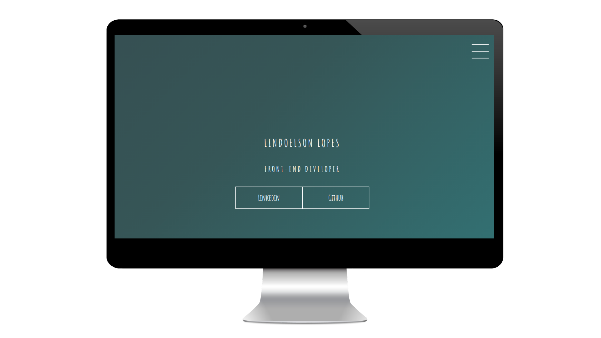

# 🚀 Modelo de Portfólio 📁

## 📃 Sobre

Projeto desenvolvido por [Lindoelson Lopes] (https://github.com/lindoelsonLopes), referente ao Bootcampo TQI Fullstack Developer na DIO.me.

Criação de um modelo de Portfólio usando HTML e CSS Transitions.

[Cique aqui] (https://lindoelsonlopes.github.io/ProjetoDioPortf-fio/) para conferir a versão final do projeto no seu navegador.